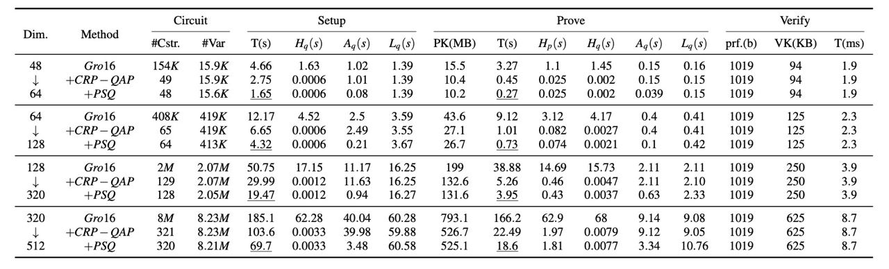
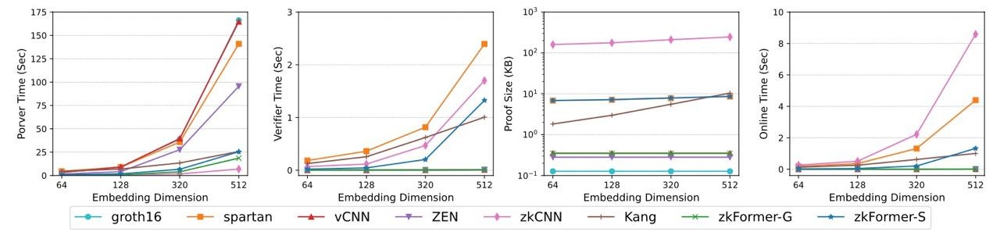
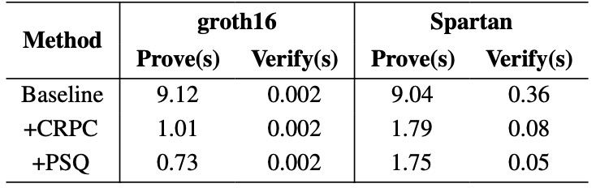

# zkVC: Fast Zero-Knowledge Proof for Private and Verifiable Computing

This is the code for zkVC: Fast Zero-Knowledge Proof for Private and Verifiable Computing. This code is built upon [libsnark](https://github.com/scipr-lab/libsnark): a C++ library for zkSNARK proofs.

## Overview and installation

For better understanding of the code structure and functions, the idea of zkSNARKs is briefly introduced. A prover who knows the witness for the NP statement (i.e., a satisfying input/assignment) can produce a short proof attesting to the truth of the NP statement. This proof can be verified by anyone, and offers the following properties.

-   __Zero knowledge:__
    the verifier learns nothing from the proof beside the truth of the statement (i.e., the value _qux_, in the above examples, remains secret).
-   __Succinctness:__
    the proof is short and easy to verify.
-   __Non-interactivity:__
    the proof is a string (i.e. it does not require back-and-forth interaction between the prover and the verifier).
-   __Soundness:__
    the proof is computationally sound (i.e., it is infeasible to fake a proof of a false NP statement). Such a proof system is also called an _argument_.
-   __Proof of knowledge:__
    the proof attests not just that the NP statement is true, but also that the
    prover knows why (e.g., knows a valid _qux_).

We refer to [libsnark](https://github.com/scipr-lab/libsnark) for more details. Please install libsnark properly.

## Testing

To test the CRPC and PSQ in zkFormer, please run tests for ```libsnark/zk_proof_systems/ppzksnark/r1cs_gg_ppzksnark/tests/test_r1cs_gg_ppzksnark_conv.cpp```. To test a matrix multiplication (Figure 7 as well as Table 3), you can specify the shape of the matrix multiplication. Then,under the ```./build``` directory, you can build and run the test by:

    make && make check

To check the runtime, memory usage and breakdown, check the log files in ```build/Testing/Temporary/LastTest.log```.

## Reproducing the results

### Microbenchmark for matrix multiplication
The experiments consist of matrix multiplication of different sizes. Specifically, we test the matrix multiplication of $[dim_{out},dim_{in}] \times [dim_{in}, tokens\_num] $. To test the matrix multiplication, under ```libsnark/zk_proof_systems/ppzksnark/r1cs_gg_ppzksnark/tests/test_r1cs_gg_ppzksnark_conv.cpp```, specify the shape the matrix and then run ```make && make check```. The arguments $(row, com, col)$ should be set as $(64,48,49)$, $(128,64,49)$, $(320,128,49)$ and $(512,320,49)$ respctively. Functions involved:

* test_r1cs_gg_ppzksnark( ) in ```libsnark/zk_proof_systems/ppzksnark/r1cs_gg_ppzksnark/tests/test_r1cs_gg_ppzksnark_conv.cpp```.
* generate_r1cs_example_with_matrix( ) in ```libsnark/relations/constraint_satisfaction_problems/r1cs/examples/r1cs_examples.tcc``` to generate a R1CS example with witness.
* The optimization is mudulizaed as a ```matrix_gadget``` class in ```libsnark/gadgetlib3/matrix_gadget.hpp``` as well. One can build R1CS instance from the gadgets, as shown in ```libsnark/models/r1cs_examples/generate_from_model.hpp```.





### Test the effect of the proposed methods
The experiments consist of running the matrix multiplication with $(row, com, col)$ set to $(128,64,49)$ on different cirsuits: (1) naive circuit; (2) CRPC circuit and (3) CRPC+PSQ circuit. The test these circuits, change the ```generate_r1cs_example_with_matrix()``` function in ```libsnark/zk_proof_systems/ppzksnark/r1cs_gg_ppzksnark/tests/test_r1cs_gg_ppzksnark_conv.cpp```. ```generate_r1cs_example_with_matrix()``` for the naive implementattion, ```generate_r1cs_example_with_matrix_opt``` for $+CRPC$ and ```generate_r1cs_example_with_matrix_opt_4``` for $+CRPC+PSQ$.


Check the ```build/Testing/Temporary/LastTest.log``` for a detailed runtime breakdown, key sizes as well as memory usage.

<!-- ### End-to-end runtime
The end-to-end runtime is approximated. The component demo code is under ```libsnark/gadgetlib3```. The runtime is computed by runnning each matrix multiplication in the attention module and MLP layer individually. -->

